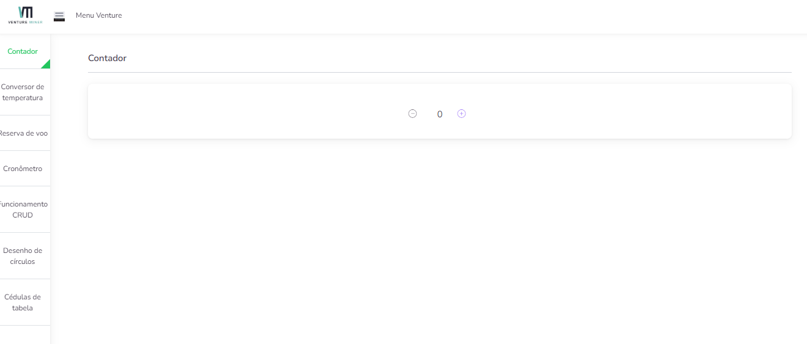

<p align="center">
  
</p>

<h3 align="center">Enunciado:</h3>

<p align="center">
  1- Crie um repositório novo na sua conta de gihbub
  2- Adicione um commit inicial marcando o horário de início do teste
  3- Configure o seu projeto para utilizar VueJS com Vite e Tailwind
  4- Crie uma página inicial de apresentação para o seu projeto
  Importante: Utilize o estilo de API com o Composition API e desenvolva os componentes com Single-File Components
  5- Crie um menu lateral com sete links, crie mais sete páginas e atribua uma rota para cada uma
  6- Implemente os sete exemplos de GUIs da documentação do Vue (https://vuejs.org/examples/)  e aplique estilos para os elementos utilizando Tailwind
  Importante: Cada elemento deve ter sua própria página. Por exemplo, o elemento contador (https://vuejs.org/examples/#counter) deve estar dentro de uma página chamada "Counter" e deve funcionar igual como demonstrado na documentação, porém o layout e a interface da página deve estar estilizada com textos, cores, background, espaçamentos e etc, conforme julgar melhor para demonstrar suas habilidades.
  7- Implemente testes de componentes para cada uma das páginas
  Sugestão: Utilizar o Vitest para os testes de componentes
  8- Adicione um último commit marcando o horário de conclusão do teste
  9- Coloque o repositório público e envie o link por email para concluir o teste
</p>

<p align="center">
  <div>
    
  <div>
  <div>
    
  <div>
  <div>
    
  <div>
  <div>
    
  <div>
  <div>
    
  <div>
  <div>
    
  <div>
  <div>
    
  <div>
</p>

### Palavras Chave

-   ⚡️ [Vue 3](https://github.com/vuejs/vue-next) & [Vite](https://vitejs.dev)
-   [Vue GUIs](https://vuejs.org/examples/)
-   [Vitest](https://vitest.dev/)
-   📦 [TailwindCss](https://tailwindcss.com/)
-   📑 [Vue-Router](./src/routes/index.js)


## Installation ⚒️

> We recommend you use yarn

1. Install all packages

    ```bash
    yarn install [for yarn]

    # npm install [for npm]
    ```

2. Run development server

    ```bash
    yarn dev

    # npm run dev [for npm]
    ```

3. Generate build files for deployment

    ```bash
    yarn build

    # npm run build [for npm]
    ```

## Run Locally

Clone the project

```bash
  git clone https://github.com/silassantos21/teste-venture-vue-tailwind.git
```

Go to the project directory

```bash
  cd teste-venture-vue-tailwind
```

Install dependencies

```bash
  yarn
```

Start the server

```bash
  yarn dev
```
